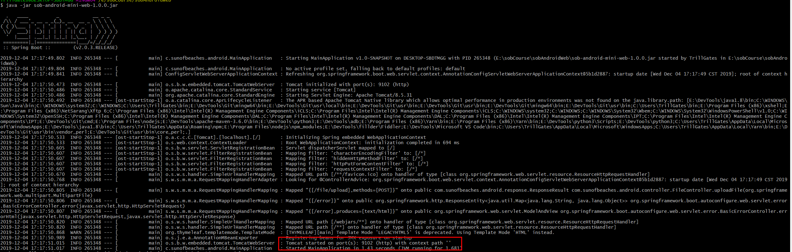

# SOBAndroidMiniWeb

阳光沙滩开发的一款android初学者网络编程学习的程序


# 使用

先clone 项目到本地

**不要修改jar包的名字**

环境：得有java环境

启动程序：

```shell
java -jar sob-android-mini-web-1.0.0.jar
```

看到这个端口，说明启动了，看不清就右键打开原图吧



# 功能

- 文本请求
- 图片请求
- 文件下载
- 文件上传

# 基本路径

本地浏览器测试地址为

```shell
http://localhost:9102/get/text
```

或者

```shell
http://127.0.0.1:9102/get/text
```


进行访问即可。


手机连接同一个局域网的时候，查看ifconfig/ipconfig，看看电脑的ip是多少 。访问地址为

```shell
ip:9102/get/text
```

模拟器同一电脑访问地址：

```shell
10.0.2.2:9102/get/text
```

进行测试即可。

# 接口

## 获取文本数据

方法：get

接口：

```shell
/get/text
```

参数：无

返回：

```json
{
    "success": true,
    "code": 10000,
    "message": "获取成功",
    "data": [
        {
            "id": "1202177685208530944",
            "title": "Android加载大图片，解决OOM问题",
            "viewCount": 104,
            "commentCount": 50,
            "publishTime": "2019-12-04T10:47:50.192+0000",
            "userName": "程序员拉大锯",
            "cover": "/imgs/14.png"
        },
        {
            "id": "1202177685208530945",
            "title": "Volley/Xutils对大图片处理算法源码分析",
            "viewCount": 269,
            "commentCount": 24,
            "publishTime": "2019-12-04T10:47:50.192+0000",
            "userName": "程序员拉大锯",
            "cover": "/imgs/11.png"
        }
    ]
}
```

# 获取图片内容

直接使用上面的图片路径访问即可：

图片资源

方法：get

```shell
/imgs/xx.png
```

xx范围：0~16

# get带参数请求

方法：get

接口：

```shell
/get/param
```

参数：

- keyword  关键字
- page 页码
- order 0 顺序 1 逆序

返回：

```json
{
    "success": true,
    "code": 10000,
    "message": "get带参数请求成功.",
    "data": {
        "page": "1",
        "keyword": "你好呀",
        "order": "逆序"
    }
}
```

异常：

```json
{
    "success": false,
    "code": 11111,
    "message": "顺序参数非法",
    "data": null
}
```

# 单文件上传

方法：post

接口：

```shell
/file/upload
```

参数：

文件 file

返回：

```json
{
    "success": true,
    "code": 10000,
    "message": "上传成功.文件路径为：E:\\codes\\Idear\\SobNetworkCourseServer\\target\\classes\\sobUpload\\0.png",
    "data": null
}
```

# 多文件上传

方法：post

接口：

```shell
/files/upload
```

参数：

文件列表 files

返回：

```json
{
    "success": true,
    "code": 10000,
    "message": "上传成功3个文件，路径：E:/codes/Idear/SobNetworkCourseServer/target/classes/sobUpload",
    "data": null
}
```


# 上传文件携带参数

方法：post

接口：

```
/file/params/upload
```

参数file，文件类型

description 描述 字符串类型

isFree是否免费“true/false” 字符串类型

返回：

```json
{success=true, code=10000, message='上传成功.文件路径为：E:\codes\Idear\SobNetworkCourseServer\target\classes\sobUpload\rBsADV3nxtKACoSfAAAPx8jyjF8169.png', data=your descriptions is --> "我是文件的描述内容..." isFree == > "false"}
```

# 提交评论

方法：post

接口

```shell
/post/comment
```

body json 字段

articleId:文章id

commentContent:评论内容

eg：

```json
{
	"articleId":"234123",
	"commentContent":"这是评论内容"
}
```

返回：

```json
{
    "success": true,
    "code": 10000,
    "message": "评论成功:这是评论内容",
    "data": null
}
```


# 提交字符串

方法：post

接口

```shell
/post/string
```

参数：

string 字符内容

```shell
 localhost:9102/post/string?string=内容测试内容
```

返回：

```json
{
    "success": true,
    "code": 10000,
    "message": "提交字符串成功:内容测试内容",
    "data": null
}
```


# 文件下载

方法：get

接口：

```shell
/download/{fileName}
```

fileName的取值为：[0,16]

返回：

文件流


